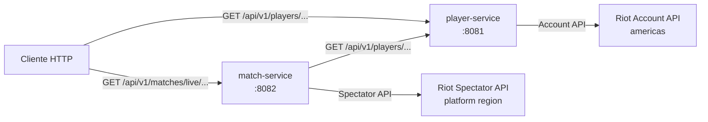

# Arquitectura propuesta de rift-analytics

## Estado del documento

- Fase: implementacion de player-service y match-service.
- Estado: ambos servicios creados y validados de forma independiente.
- Fecha: 2026-09-10.
- Alcance: separar las consultas de jugadores y partidas activas del monolito actual.

Este documento describe la arquitectura objetivo de la primera etapa. No crea ni comparte clases Java entre servicios. La compatibilidad con los endpoints publicos actuales es una restriccion principal.

## Objetivos y restricciones

### Objetivos

- Mantener los endpoints publicos y sus respuestas exitosas.
- Separar el dominio de cuentas de jugador del dominio de partidas activas.
- Permitir compilacion, pruebas y ejecucion independiente de cada servicio.
- Mantener Java 21 y Spring Boot.
- Mantener la clave de Riot fuera del codigo y de los repositorios.
- Hacer explicita mediante HTTP la dependencia entre partidas y jugadores.

### Restricciones

- No compartir clases Java, paquetes internos ni bases de datos entre servicios.
- No introducir service discovery en esta etapa.
- No introducir un API gateway mientras no exista un beneficio operativo claro.
- No almacenar secretos en `application.properties`, Compose ni documentacion.
- Mantener el comportamiento `404` para cuentas inexistentes y `204` cuando no haya partida activa.

## Arquitectura de componentes



El monolito actual sirve como referencia de comportamiento durante la migracion. La arquitectura objetivo no requiere que los servicios compartan proceso, memoria, clases ni persistencia.

## Limites de servicio

### player-service

Responsabilidad unica: resolver una identidad Riot mediante `gameName` y `tagLine`.

- Controla `GET /api/v1/players/{gameName}/{tagLine}`.
- Consulta `GET /riot/account/v1/accounts/by-riot-id/{gameName}/{tagLine}` en Riot.
- Es propietario de sus DTOs de entrada y salida.
- Traduce la cuenta inexistente a `404 Not Found`.
- No conoce partidas, regiones de plataforma ni `match-service`.

### match-service

Responsabilidad unica: consultar la partida activa asociada a un jugador.

- Controla `GET /api/v1/matches/live/{region}/{gameName}/{tagLine}`.
- Valida `region` antes de construir una URL externa.
- Obtiene el `puuid` llamando por HTTP a `player-service`.
- Consulta `GET /lol/spectator/v5/active-games/by-summoner/{puuid}` en Riot.
- Devuelve `204 No Content` cuando Riot responde `404` para la partida activa.
- Devuelve `404 Not Found` cuando `player-service` indica que la cuenta no existe.
- No importa ni reutiliza clases de `player-service`.

### api-gateway

No se crea en esta etapa. Con dos servicios y dos rutas principales, un gateway agregaria un salto de red y configuracion sin resolver una necesidad transversal actual.

La futura incorporacion puede enrutar:

- `/api/v1/players/**` hacia `player-service`.
- `/api/v1/matches/**` hacia `match-service`.

Solo se justificara cuando haya autenticacion comun, rate limiting, observabilidad transversal, versionado de APIs o un numero de servicios que haga necesario centralizar el borde. No debe contener logica de negocio.

## Proyectos y puertos

Cada servicio tendra su propio proyecto Maven, `pom.xml`, clase de entrada, `application.properties`, DTOs, pruebas y ciclo de ejecucion.

| Componente | Puerto local | Base URL local | Dependencia |
| --- | ---: | --- | --- |
| `player-service` | `8081` | `http://localhost:8081` | Riot Account API |
| `match-service` | `8082` | `http://localhost:8082` | `player-service`, Riot Spectator API |
| monolito de referencia | `8080` | `http://localhost:8080` | Riot APIs |
| `api-gateway` | No aplica | No se crea | No aplica |

Los puertos son valores locales por defecto y deben poder sobrescribirse mediante configuracion externa.

## Contratos HTTP publicos

### Consulta de jugador

```http
GET /api/v1/players/{gameName}/{tagLine}
Accept: application/json
```

Respuesta exitosa `200 OK`:

```json
{
  "puuid": "string",
  "gameName": "string",
  "tagLine": "string"
}
```

Respuesta de cuenta inexistente: `404 Not Found`, sin cuerpo requerido.

La forma JSON mantiene los nombres actuales de `RiotAccountDto`. Los campos desconocidos de Riot no se exponen.

### Consulta de partida activa

```http
GET /api/v1/matches/live/{region}/{gameName}/{tagLine}
Accept: application/json
```

Respuesta exitosa `200 OK`:

```json
{
  "gameId": 123456789,
  "gameMode": "CLASSIC",
  "gameLength": 120,
  "gameStartTime": 1700000000000,
  "participants": [
    {
      "puuid": "string",
      "summonerId": "string",
      "championId": 1,
      "teamId": 100,
      "spell1Id": 4,
      "spell2Id": 14
    }
  ]
}
```

Los campos conservan la forma actual de `CurrentGameInfoDto` y `CurrentGameParticipantDto`. Los campos adicionales de Riot se ignoran.

Casos definidos:

| Situacion | HTTP | Cuerpo |
| --- | ---: | --- |
| Cuenta y partida encontradas | `200` | JSON de partida |
| Cuenta Riot inexistente | `404` | Vacio o error estandar |
| Cuenta valida sin partida activa | `204` | Vacio |
| Region invalida | `400` | Error estandar |
| `player-service` no disponible | `503` | Error estandar |
| Riot no disponible o error upstream no esperado | `502` o `503` | Error estandar |

La eleccion entre `502` y `503` se implementara de forma consistente y se fijara en las pruebas: `503` para indisponibilidad temporal y `502` para una respuesta upstream invalida o no traducible.

## Contrato HTTP interno

`match-service` llamara a `player-service` con el mismo contrato de consulta de jugador:

```http
GET {PLAYER_SERVICE_URL}/api/v1/players/{gameName}/{tagLine}
Accept: application/json
```

Respuesta esperada:

```json
{
  "puuid": "string",
  "gameName": "string",
  "tagLine": "string"
}
```

Reglas del cliente interno:

- Codificar correctamente `gameName` y `tagLine` como variables de ruta.
- No reenviar la clave de Riot al servicio de jugadores.
- Mantener timeouts explicitos de conexion y respuesta.
- Traducir `404` del servicio de jugadores a `404` publico de `match-service`.
- Traducir timeout, conexion rechazada y error de transporte a `503`.
- No hacer reintentos automaticos en esta primera version para evitar duplicar trafico y latencia.

## Configuracion y variables de entorno

### player-service

| Propiedad | Variable | Valor local de ejemplo | Obligatoria |
| --- | --- | --- | --- |
| `server.port` | `PLAYER_SERVICE_PORT` | `8081` | No |
| `riot.api.key` | `RIOT_API_KEY` | No se documenta un valor real | Si |
| `riot.api.americas-url` | `RIOT_AMERICAS_URL` | `https://americas.api.riotgames.com` | Si |

### match-service

| Propiedad | Variable | Valor local de ejemplo | Obligatoria |
| --- | --- | --- | --- |
| `server.port` | `MATCH_SERVICE_PORT` | `8082` | No |
| `riot.api.key` | `RIOT_API_KEY` | No se documenta un valor real | Si |
| `riot.api.platform-url-template` | `RIOT_PLATFORM_URL_TEMPLATE` | `https://{region}.api.riotgames.com` | Si |
| `player.service.url` | `PLAYER_SERVICE_URL` | `http://localhost:8081` | Si |
| `player.service.connect-timeout` | `PLAYER_SERVICE_CONNECT_TIMEOUT` | Valor definido por defecto seguro | No |
| `player.service.read-timeout` | `PLAYER_SERVICE_READ_TIMEOUT` | Valor definido por defecto seguro | No |

La configuracion por defecto no incluira claves reales. El nombre de cada variable podra mapearse a propiedades Spring mediante `application.properties` o `application.yml` sin introducir secretos en el repositorio.

## Validacion de entradas y errores

- `region` solo aceptara caracteres alfanumericos, siguiendo la validacion actual.
- Una region invalida producira `400 Bad Request`, no una llamada a Riot.
- Los errores de Riot no deben filtrarse con stack traces ni claves en la respuesta.
- Las respuestas de error tendran una forma consistente, preferiblemente el formato de error de Spring Boot, sin convertir el contrato exitoso.
- La configuracion ausente de `RIOT_API_KEY` debe impedir un arranque valido o producir un error de configuracion claramente detectable, nunca una llamada sin autenticacion.
- CORS no se dejara abierto globalmente por defecto. Si el frontend lo requiere, se configurara mediante origenes externos y documentados.

## Estrategia de pruebas

### player-service

- Prueba unitaria del cliente/servicio Riot con respuesta valida.
- Prueba unitaria de traduccion de `404` y errores upstream.
- Prueba de contexto de Spring con configuracion de prueba.
- Prueba MVC del endpoint con `200` y JSON esperado.
- Prueba MVC del endpoint con cuenta inexistente y `404`.
- Verificacion de que la clave se configura externamente.

### match-service

- Prueba unitaria de validacion de region.
- Prueba unitaria del mapeo de `puuid` al cliente de Riot Spectator.
- Prueba unitaria de `204` ante `404` de la partida activa.
- Prueba del cliente HTTP hacia `player-service` con respuesta `200`.
- Prueba de propagacion de `404` del jugador.
- Prueba de `503` cuando `player-service` no responde.
- Prueba de errores `502`/`503` procedentes de Riot.
- Prueba MVC del endpoint con `200`, `204`, `400`, `404` y `5xx`.
- Prueba de contrato HTTP con un servidor simulado local; no depender de Riot real.

### Validacion independiente

Para cada servicio se ejecutaran por separado:

```text
mvnw.cmd test
mvnw.cmd spring-boot:run
```

La validacion final comprobara tambien:

- Arranque de `player-service` sin `match-service`.
- Arranque de `match-service` con un stub de `player-service`.
- Ausencia de imports entre proyectos.
- Ausencia de secretos mediante busqueda de valores Riot en el codigo.
- Compatibilidad de los endpoints publicos con el comportamiento del monolito.

## Ejecucion local prevista

En la fase de ejecucion se podra añadir un `docker-compose.yml` con ambos servicios. El Compose recibira estas variables desde el entorno del usuario:

```text
RIOT_API_KEY
RIOT_AMERICAS_URL
RIOT_PLATFORM_URL_TEMPLATE
PLAYER_SERVICE_URL
```

No se incluira ninguna clave real ni un valor que permita confundir un ejemplo con un secreto. Los servicios se podran ejecutar tambien de forma independiente desde sus respectivos directorios Maven.

## Orden de implementacion y migracion

1. Crear `player-service` con sus DTOs, configuracion, cliente Riot, controlador y pruebas.
2. Validar `player-service` de forma independiente y comparar su contrato con el monolito.
3. Crear `match-service` con DTOs propios, cliente HTTP de `player-service`, cliente Spectator, control de errores y pruebas.
4. Validar el flujo completo con un `player-service` real local y Riot simulado o controlado.
5. Mantener el monolito operativo durante la transicion para permitir rollback por trafico o configuracion.
6. Revaluar el gateway despues de medir el flujo y el numero real de servicios.
7. Anadir ejecucion local documentada y Compose cuando ambos servicios hayan pasado sus pruebas independientes.

## Rollback

El rollback inicial sera operacional:

- Mantener el monolito en `8080` mientras los servicios usan `8081` y `8082`.
- No eliminar los endpoints del monolito hasta validar los nuevos servicios.
- Si `match-service` falla, dirigir temporalmente el trafico de partidas al monolito.
- Si `player-service` falla, detener la migracion del flujo dependiente sin modificar la API de Riot.
- Evitar migraciones de datos porque esta etapa no introduce persistencia propia.

## Decisiones y trade-offs

- **Dos servicios y sin gateway:** reduce complejidad inicial y mantiene limites funcionales claros; posterga preocupaciones transversales hasta que exista evidencia suficiente.
- **HTTP entre `match-service` y `player-service`:** introduce latencia y un punto de fallo, pero cumple el aislamiento de servicios y hace explicito el contrato.
- **Sin reintentos iniciales:** evita tormentas de solicitudes y comportamiento no determinista; se podran añadir despues con limites, timeouts y observabilidad.
- **DTOs propios por servicio:** aumenta algo de duplicacion, pero evita acoplamiento de compilacion y permite evolucionar los contratos de forma independiente.
- **Sin base de datos en esta etapa:** preserva el comportamiento actual, que es de consulta directa a Riot, y evita una migracion de datos prematura.

## Riesgos pendientes

- Limites de rate de Riot pueden afectar ambos servicios de forma independiente.
- La dependencia sin cache entre servicios puede aumentar latencia.
- Debe concretarse la forma final de los errores `502` y `503` en las pruebas de contrato.
- La politica CORS necesita un origen real del frontend antes de endurecerse.
- La compatibilidad exacta de Spring Boot `4.1.1` con las librerias de pruebas se verificara al crear cada proyecto.
- La clave de Riot sera necesaria para una prueba real de integracion; las pruebas automaticas no dependeran de ella.

## Criterio de aprobacion de la siguiente fase

No se comenzara la implementacion hasta aprobar explicitamente este diseño. La aprobacion debe cubrir:

- Los limites de `player-service` y `match-service`.
- Los puertos `8081` y `8082`.
- El contrato HTTP interno basado en `puuid`.
- La decision de posponer `api-gateway`.
- La estrategia de errores, pruebas y rollback.
